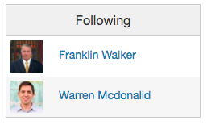

# README

# Runagr

[Runagr][heroku]

[heroku]: https://runagr.herokuapp.com

Runagr is a full-stack web application that tracks your runs similar to Strava.  It utilizes Ruby on Rails on the backend, a PostgreSQL database, and React.js with a Redux architectural framework on the frontend.  

## Features & Implementation

### Routes

Routes take up a single `route` table consisting of the `title`, `description`, `map` for the map coordinates in JSON and the `user_id` referencing the user who created the route.

The React components for routes breaks down as follows: `RouteIndex` renders the `RouteAtGlance` for each route the user has. This creates a static-map image through the `SmallMap` component for each route which links to the full details of the route using the `RouteDetails`. The `RouteDetails` contains the component `RouteDraw` which gives us the `LargeMap` and renders the basic information of the route. Creation of routes is handled through the `RouteMap` component which renders a full size map and creates a hidden `RouteForm` to be used when needed.

Route creation is implemented using the Google Maps api. I used google.maps.Polylines that snap to the road using the google.maps.DirectionsService. I store the coordinates created by these Polylines as JSON.

### Activities

Activities are contained in the `activity` table. Each activity is comprised of: a `user_id` for the creator of said activity, a `route_id` for the route that was followed for the activity (-1 for no route), a `title`, a `description`, a `start_time` and `date` for the time and date that the activity took place, `duration` for the time it took to complete the activity.

Activity creation is handled by the `ActivityForm`. This container renders a form that has inputs for the details of your run as well as a dynamically updating `SmallMap` of the current route chosen. Once you create an activity you are taken to the `ActivityDetails`. This component handles the formatting of the activity details and delegating map rendering to the `ActivityMap`.

The activities for the current user are held in an index page. This index is handled by the `ActivityIndex` component. This delegates out the details of each run to an `ActivityRow` component which creates rows for the activity table.

### Activity Feed

The Activity Feed shows the activities for the current user and all of the users that the current user follows. The main `ActivityFeed` component uses the `ActivityDate` component to create a row for just the date and the `ActivityItem` component to give a short form version of the activities details.

### Activity Stats

The main Activity Stats are housed in the `ActivityStats` component. This renders the weekly details of the current user (mileage, total time spent, average pace) and it uses `ActivityGraph` to create a bar graph of the miles for each day of the current week.

### Profiles

User profiles are contained in the `Profile` component. It houses a hidden `ProfileForm` for editing your profile if you are on your own profile page. The users profile picture, first name and last name are rendered directly in the component. There is a conditionally placed follow button for following a user. The `Profile` uses `ActivityMonth` and `ProfileFeed` components to render activity details for the user.

The Activity Month is shown in the each users profile using the `ActivityMonth` component. This shows a small calendar for the last four weeks which has circles on the dates that the user was active on. It also calculates how many activities the user has completed during the same time frame.

The Profile Feed is similar to the Activity Feed except for the only activities shown are those of the profile's user. This component reuses the `ActivityDate` and `ActivityItem` components from the `ActivityFeed`.

### Follows

Follows are stored in the `follow` table which is used to join a `user_id` and a `follow_id` for users who want to follow other users activities.

The main dashboard has a `FollowIndex` showing all of the users that you follow.

## Future for the Project

Below are some of the things I hope to continue working on and implementing in the near future .

### Comments

Comments will be available on routes and activities and will help create a more social aspect to the app.

### Sharing routes

I would like to have the routes be shareable in that you can take any route and your times on the route could be compared to everyone else's times thus creating some leaderboard functionality.
